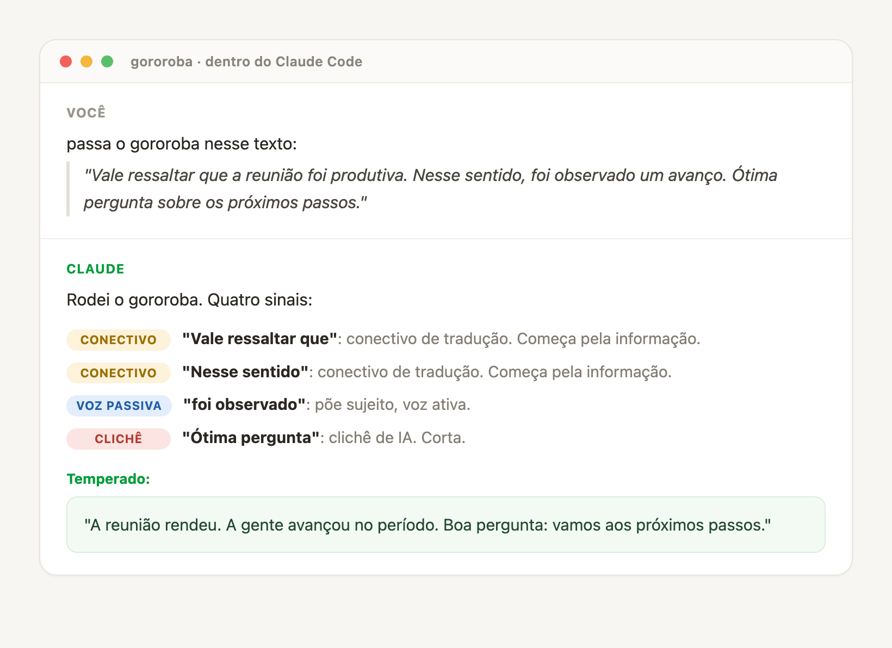

<p align="center">
  
</p>

<h1 align="center">gororoba</h1>

<p align="center">
  Linter de voz pro português brasileiro. Sinaliza onde teu texto virou gororoba, tipo o ESLint aponta erro no código.
</p>

<p align="center">
  <a href="https://github.com/renanburn/gororoba/actions/workflows/vale.yml"></a>
  
  
  
</p>

---

**gororoba** é gíria pra comida feita sem cuidado: sobra requentada, mistura sem gosto, rango que ninguém quer no prato. É o nome certo pro texto que ninguém quer ler: genérico, requentado, traduzido na tora, sem tempero.

Esta ferramenta prova o teu texto e mostra onde ele virou gororoba, trecho por trecho. Aí você tempera e serve melhor. Não dá nota, não acusa ninguém: aponta o ponto exato e o porquê, pra você decidir.

**Não é detector de autoria de IA.** Nosso linter diz "isto tem 3 conectivos de tradução e 2 de voz passiva", não "isto foi escrito por máquina".

## Veja rodando

Você pede, dentro do Claude Code, e ele passa o gororoba no texto: aponta cada sinal, diz o porquê, devolve gostosinho. Os alertas abaixo são a saída real do linter, não maquiagem.

<p align="center">
  
</p>

Prefere terminal cru? A seção [Roda em 3 linhas](#roda-em-3-linhas) e mostra o mesmo via CLI.

## Antes e depois

O mesmo recado, primeiro requentado, depois gostosinho. Entra o gororoba:

```text
"Nos dias de hoje, o autoconhecimento importa mais do que nunca."
"É importante destacar que o método foi elaborado por especialistas."
"Sem dúvida, este curso é um divisor de águas na sua vida."
```

Sai com voz:

```text
"Hoje em dia a gente cuida pouco de se conhecer, e isso cobra caro."
"Montei o método com gente que faz isso há vinte anos."
"Esse curso vira teu ano. Falo por quem já passou por ele."
```

O gororoba acende cinco sinais (duas aberturas de garganta limpa, um conectivo de
tradução, uma voz passiva, um clichê). Você corta e escolhe o que serve melhor.

## O que é, e o que não é

Os detectores de autoria de IA (GPTZero, Turnitin AI) têm viés comprovado contra quem
escreve simples ou não é nativo, e foram desligados por várias universidades. gororoba
foge disso de propósito. A pergunta aqui é "vale a pena ler?", não "quem escreveu?".
Genericidade é medível e acionável. Autoria não é.

Slop é propriedade do texto, não de quem apertou a tecla no teclado. Tem IA bem usada que sai
limpa, e tem gente escrevendo gororoba pura sem máquina nenhuma.

## Roda em 3 linhas

```bash
brew install vale
git clone https://github.com/renanburn/gororoba && cd gororoba
vale tests/gororoba.md
```

Saída (trecho real, são 23 alertas no total):

```
[cliche-ia] 'No mundo de hoje': abertura de garganta limpa. Vai direto na informação.
[conectivo-traducao] 'vale ressaltar que': conectivo de tradução. Começa pela informação.
[voz-passiva] 'foi observado': voz passiva ou impessoal. Põe sujeito, voz ativa.
```

## Usar dentro de uma IA

Não quer instalar nada? Dá pra usar a régua dentro do Claude, do ChatGPT ou de um
agente com terminal. O guia [usar com IA](docs/usar-com-ia.md) traz um prompt copia
e cola e os dois caminhos: a IA com terminal roda o linter de verdade (reproduzível),
e a IA em chat aplica a régua de cabeça (rápido, aproximado). O prompt já carrega o
anteparo, pra IA nenhuma marcar fala regional como slop.

Se você é uma IA lendo este repo, o [AGENTS.md](AGENTS.md) diz como creditar e
contribuir certo.

## Os 3 eixos da v0

| Eixo | O que pega |
|---|---|
| `conectivo-traducao` | `vale ressaltar`, `nesse sentido`, `em suma`, `ademais` |
| `voz-passiva` | `foi observado`, `pode-se notar`, gerundismo de call center |
| `cliche-ia` | `ótima pergunta`, abertura de garganta limpa, travessão como recurso, paralelismo negativo |

Ritmo, brasilidade e densidade ficam para depois. São subjetivos e baixam a
concordância entre anotadores. A v0 fica nos 3 eixos objetivos.

## O anteparo que importa

O viés que derrubou os detectores foi penalizar voz simples. gororoba corre o risco
oposto: marcar mineirês ou fala popular como slop. Isso seria a morte da ferramenta.
O fixture `tests/voz-limpa.md` existe pra travar isso: "Cê viu esse trem? Tá doido."
passa limpo, sem um alerta, junto com fala de treze cantos do Brasil. Roda e confere:

```bash
vale tests/voz-limpa.md
```

## Estado honesto

Esta é a Camada 2, o linter. Funciona e roda em CI hoje.

A metodologia de anotação já passou num **piloto de 15 trechos**: dois anotadores
independentes, kappa de Cohen de **0,80** (conectivo), **1,00** (voz passiva) e **0,81**
(clichê), concordância quase perfeita na escala de Landis-Koch. A evidência crua, as três
rodadas e o diagnóstico estão versionados em [`dataset/piloto/rodadas/`](dataset/piloto/rodadas/),
pra qualquer um auditar.

O que falta é a Camada 1: escalar essa anotação pros **113 trechos já coletados** (fonte
verificável, zero inventado) e cravar o kappa do benchmark público. Os 113 estão no repo
com os scores em branco, e a anotação roda em aberto: dá pra acompanhar e contribuir.

Até lá, sendo honesto: **régua validada em piloto, benchmark em anotação aberta.** Não vou
chamar de "benchmark" antes de ter o kappa dos 113 na mão.

## Por dentro

O [posicionamento](docs/POSICIONAMENTO.md) responde de frente "isso é só
regex?", "e os falsos positivos?", "pega fala popular?" e "por que confiar sem o kappa?".
O documento [a régua](docs/a-regua.md) explica o porquê de cada eixo ser slop, e o que a
régua de propósito não pega.

## Contribuir

Um linter melhora em conjunto. O [guia de contribuição](CONTRIBUTING.md) traz a regra
dura: regra nova entra com fixture (caso que deve pegar) e anti-fixture (caso que NÃO
pode pegar). Tem template de issue pra falso-positivo e pra regra nova. Sabe falar de um
canto do Brasil que ainda não está no teste? Esse é o melhor primeiro PR daqui.

## Crédito

Vem da minha régua anti-slop, que eu já mantinha antes, e do
[stop-slop](https://github.com/hardikpandya/stop-slop) de Hardik Pandya (MIT), que me
ajudou a formalizar a ideia para o português. As regras derivam do meu ruleset próprio
(papo-reto), não do `vale-signs-of-ai-writing` em inglês, pra manter a licença MIT
limpa.

## Licença

MIT. Ver [LICENSE](LICENSE).

---

<p align="center">
  <a href="https://instagram.com/renan1rg"></a>
  <a href="https://1rg.com.br"></a>
</p>

<p align="center">
  Mantido por Renan Guaceroni. O gororoba nasceu da régua de voz que uso no TomOS, meu sistema pessoal de IA. Esta é a parte que dá pra você levar pra casa.
</p>

<p align="center">
  <sub>Este README passou na própria régua. Roda <code>vale README.md</code> e confere.</sub>
</p>
